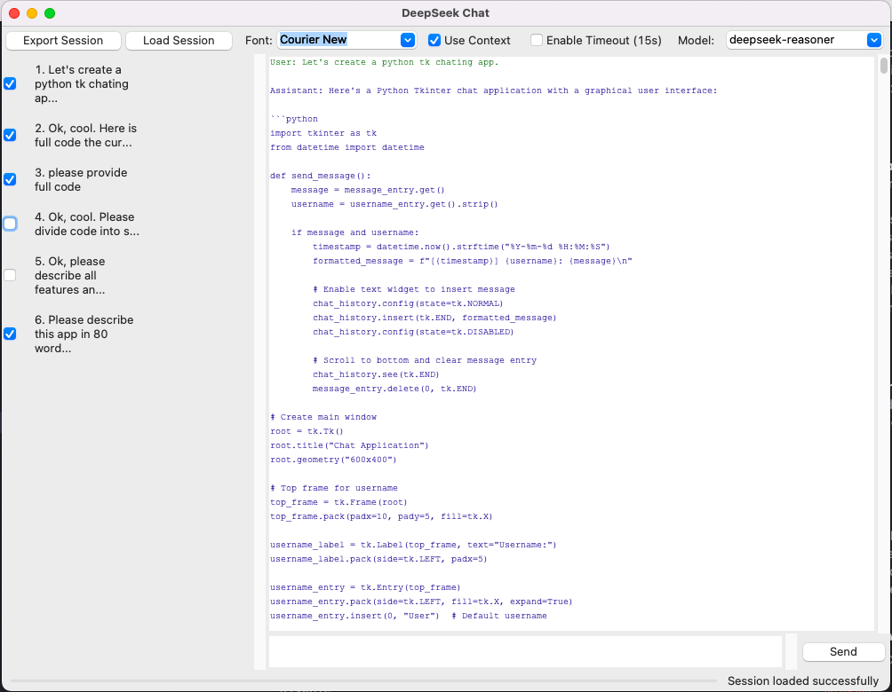

# ai_coding_chat
A sleek, lightweight tool that lets you code smarter. Chat with AI to generate, fix, or explain code in any language—instantly. Real-time suggestions, minimal interface, no clutter. Learn, troubleshoot, and build faster. ⚡✨

```
ai_coding_chat/
    ├── LICENSE
    ├── README.md
    ├── api
    │   ├── __init__.py
    │   └── client.py       # API communication handler
    ├── app.py              # Main application entry point
    ├── config.ini          # Configuration file (needs to be created by user)
    ├── config.py
    ├── gui
    │   ├── __init__.py
    │   ├── chat.py         # Chat display and input components
    │   ├── main_window.py  # Main application window and coordinator
    │   ├── navigation.py   # Left panel with message checkboxes
    │   ├── status_bar.py   # Bottom status indicators
    │   └── toolbar.py      # Top toolbar controls
    ├── main.py
    └── utils
        ├── __init__.py
        └── helpers.py      # Utility functions and handlers
```



# AI Coding Chat Client - Version 1.0

## Key Features

### Core Functionality
- **AI-Powered Chat**  
  - Direct integration with DeepSeek's API endpoints
  - Support for multiple AI models:
    - deepseek-chat
    - deepseek-reasoner

### Conversation Management
- **Context Control System**  
  - Checkbox-per-message context inclusion
  - Global context toggle (On/Off)
  - Visual conversation history navigation
  - Automatic context state persistence

### User Interface
- **Customizable Chat Experience**  
  - Font selector (Arial, Courier New, Times New Roman)
  - Color-coded message types:
    - User messages (dark green)
    - AI responses (dark blue)
    - System messages (dark red)
  - Responsive scrollable layouts
  - Session export/import (JSON format)

### Advanced Controls
- **Parameter Adjustment**  
  - Temperature slider (0.0 to 1.0)
  - Model selection dropdown
  - Timeout control (15-second toggle)

### Technical Features
- **Robust Architecture**  
  - Configurable API endpoints
  - Network error detection
  - Progress indicators
  - Comprehensive error handling

### Security & Reliability
- **API Key Management**  
  - Config file storage
  - Input validation/sanitization

## Technical Specifications
- **Requirements**  
  - Python 3.8+
  - Tkinter
  - Requests library

- **Architecture**  
  - MVC pattern implementation
  - Modular component design
  - Asynchronous API handling
  - Cross-platform compatibility

## Usage Scenarios
1. Technical support conversations
2. Programming assistance
3. Mathematical problem solving
4. Research and reasoning tasks
5. Persistent conversation analysis


- Python 3.8+
- Packages:
  - tkinter (standard library)
  - requests (HTTP client)
  - configparser (configuration parsing)
  - Pillow (optional for image support)


1. Create `config.ini` with:
```
[DEFAULT]
API_TOKEN = your_deepseek_token
API_ENDPOINT = https://api.deepseek.com/v1/chat/completions
```


2. Install dependencies:
```bash
pip install requests configparser
```

Run:
```
python main.py
```

# Possible version 2.0 Feature Roadmap

## 1. Advanced Session Management
### Session Switcher
- **Tabbed Interface**  
  - Multiple concurrent chat sessions  
  - Drag-and-drop tab reorganization  
  - Session naming/color-coding  
  - Session-specific settings preservation

- **Session Archive**  
  - Automatic session snapshots  
  - Searchable session history  
  - Session comparison view  
  - Export sessions as shareable packages

## 2. Enhanced Message Metadata
### Query Intelligence System
- **Message Metadata Tracking**  
  ```python
  {
      "timestamp": "2024-02-20T14:30:00Z",
      "model_version": "deepseek-reasoner",
      "code_context": {
          "language": "Python",
          "dependencies": ["numpy", "pandas"],
          "runtime": "3.11"
      },
      "performance_metrics": {
          "response_time": 1.45,
          "token_count": 512
      }
  }
  ```
- **Metadata Panel**  
  - Toggleable side panel with message insights  
  - Code quality metrics (cyclomatic complexity, lint scores)  
  - Contextual debugging suggestions

## 3. Visual Customization
### Theme Engine
- **Dark/Light Mode**  
  - System theme detection  
  - Customizable accent colors  
  - Syntax-highlighted code themes  
  - CSS-like style configuration

- **Project Explorer**  
  ```markdown
  Project View Features:
  - File tree navigation
  - Real-time file monitoring
  - Code preview on hover
  - Quick file actions (create/rename/delete)
  - Git integration (branch status, diffs)
  ```

## 4. Developer Productivity Tools
### Smart Prompt System
- **Preset Prompts Library**  
  ```json
  {
      "prompts": {
          "debug": {
              "template": "Analyze this {language} code for potential bugs:",
              "tags": ["debugging", "code review"]
          },
          "optimize": {
              "template": "Suggest performance optimizations for:",
              "tags": ["optimization", "benchmark"]
          }
      }
  }
  ```
- **Prompt Workshop**  
  - Custom prompt templates  
  - Context-aware prompt suggestions  
  - Collaborative prompt sharing

### Code Evolution Assistant
- **Code Update Workflow**  
  1. Receive AI-generated code  
  2. Make local edits in integrated editor  
  3. "Update Suggestions" button  
  4. AI analyzes changes and offers improvements  
  5. Side-by-side diff view

## 5. Enhanced Project Integration
### File-Aware Context
- **Project Context Engine**  
  - Automatic file context detection  
  - Relevant code section highlighting  
  - Dependency mapping  
  - API documentation lookup

- **Codebase Search**  
  - Natural language code queries  
  - "Find similar patterns" function  
  - Cross-file reference tracking

## Technical Implementation Strategy

### Phase 1: Core Infrastructure
1. Session management backend  
2. Theme system architecture  
3. Metadata tracking framework

### Phase 2: UI Modernization
1. Tabbed interface implementation  
2. Project explorer component  
3. Metadata visualization system

### Phase 3: AI Integration
1. Code change analysis pipeline  
2. Prompt templating engine  
3. Context-aware suggestion system

### Phase 4: Optimization
1. Session state compression  
2. Background indexing  
3. Cache management

## Compatibility Considerations
- **Migration Path**  
  - Automatic conversion of v1.0 sessions  
  - Config file backward compatibility  
  - Progressive feature enablement

- **Security**  
  - File access sandboxing  
  - Session encryption  
  - Permission-based file operations

---

Yuri Konoplev @ 11 Apr 2025
pm in tg @bimodaling
90% of code created with AI
